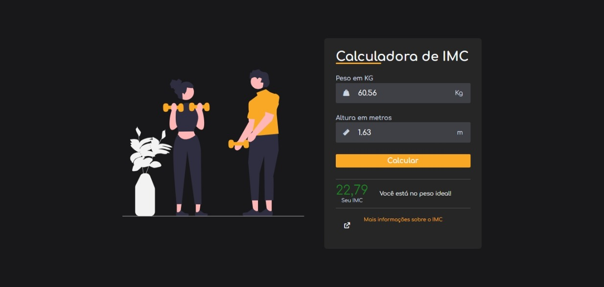

  

<h1>🏋️Calculadora IMC</h1>

 
  Trata-se de um projeto de calculadora de IMC, aplicando conhecimentos adquiridos em HTML, CSS e Javascript para interação de elementos.
  O Índice de Massa Corporal (IMC) é uma medida utilizada para avaliar se uma pessoa está dentro do peso ideal em relação à sua altura. É calculado dividindo o peso da pessoa (em quilogramas) pela altura ao quadrado (em metros). O IMC é amplamente utilizado por profissionais de saúde para identificar possíveis problemas de saúde relacionados ao peso.

 

<h2>💻Tecnologias e ferramentas utilizadas</h2>

   
   
     
          

 

📆 Atualizado em junho, 2024.
 
